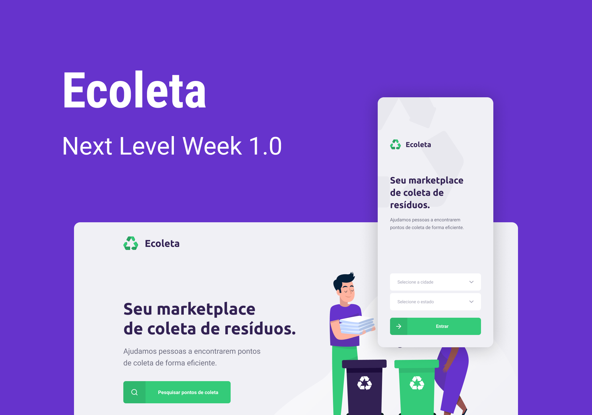

# Next Level Week 1.0

### Uma semana para acelerar sua evolução como dev e avançar para o próximo nível.

Evento 100% online e gratuito, realizado no período de 01 a 07 de Junho de 2020.

<!-- Server
npm i typescript -D
npm i express
npm i ts-node -D
npx tsc --init
npm i ts-node-dev -D
npm i knex
npm i sqlite3
npm i cors
npm i @types/cors -D
npm install multer
npm install @types/multer -D
npm install celebrate
npm install @types/hapi__joi -D

npm run dev

Validação Back-End - celebrate
-->

<!-- Migrations
npx knex migrate:latest --knexfile knexfile.ts migrate:latest
-->

<!-- Web
npx create-react-app web --template=typescript
npm install react-icons
npm install react-router-dom
npm install @types/react-router-dom -D
npm install leaflet react-leaflet
npm install @types/react-leaflet -D
npm install axios
npm install react-dropzone

npm start

Validação Fron-End - yup
-->

<!-- App
npm install -g expo-cli
expo init mobile
expo install expo-font @expo-google-fonts/ubuntu @expo-google-fonts/roboto
npm install @react-navigation/native
npm install @react-navigation/stack
expo install react-native-gesture-handler react-native-reanimated react-native-screens react-native-safe-area-context @react-native-community/masked-view
expo install react-native-maps
expo install expo-constants
expo install react-native-svg
npm install axios
expo install expo-location
expo install expo-mail-composer

expo start
-->
